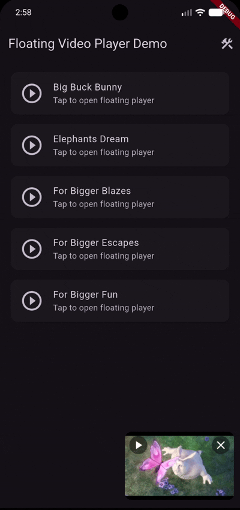

# floating_video_player

[](https://pub.dev/packages/floating_video_player)
[](LICENSE)

A Flutter package that provides a **YouTube-style floating video player** — expand to full portrait view, collapse to a draggable mini-player in any corner, or go full-screen landscape. Built on top of [`video_player`](https://pub.dev/packages/video_player) and [`chewie`](https://pub.dev/packages/chewie).

---

## Features

- **Expanded mode** — full-height portrait overlay with scrollable content below the player
- **Collapsed (mini-player) mode** — draggable, snap-to-corner picture-in-picture
- **Landscape mode** — immersive full-screen with drag-down-to-exit
- **Spring physics** — natural snap-to-corner animation using Flutter's physics engine
- **Viewport-aware** — respects bottom nav bars, side rails, and other persistent UI chrome via `ViewportInsets`
- **Custom controls** — replace the default controls with your own via `PlayerControlsBuilder`
- **Auto-hide controls** — controls fade out automatically after inactivity
- **Double-tap seek** — ±5 s seek with cumulative tap count indicator
- **Long-press fast-forward** — 2× speed while holding
- **Back-button integration** — collapses or exits appropriately

---

## Demo

### Expanded → Collapsed Transition


### Mini-Player Drag & Snap


### Landscape Mode


---

## Getting started

Add to your `pubspec.yaml`:

```yaml
dependencies:
  floating_video_player: ^0.1.0
```

### Android

Add internet permission to `android/app/src/main/AndroidManifest.xml` for network videos:

```xml
<uses-permission android:name="android.permission.INTERNET" />
```

### iOS

Add to `ios/Runner/Info.plist`:

```xml
<key>NSAppTransportSecurity</key>
<dict>
  <key>NSAllowsArbitraryLoads</key>
  <true/>
</dict>
```

---

## Usage

### 1. Wrap your app with `FloatingViewProvider`

```dart
void main() {
  runApp(
    FloatingViewProvider(
      controller: FloatingViewController(
        // Optional: tell the player about persistent UI chrome
        initialInsets: const ViewportInsets(bottom: kBottomNavigationBarHeight),
      ),
      child: MaterialApp(home: MyHomeScreen()),
    ),
  );
}
```

### 2. Open the floating player

```dart
context.floatingController.open(
  context,
  (key) => FloatingPlayerView(
    key: key,
    videoUrl: 'https://example.com/video.mp4',
    contentBuilder: (context, onSlide) {
      return MyScrollableContent(onSlide: onSlide);
    },
  ),
);
```

### 3. Control the player

```dart
final controller = context.floatingController;

controller.collapse();   // Collapse to mini-player
controller.expand();     // Restore to full view
controller.close();      // Remove the overlay entirely
controller.play();       // Play
controller.pause();      // Pause
```

### 4. Update viewport constraints at runtime

Call this whenever persistent UI chrome appears or disappears — the mini-player snaps immediately to stay within the new bounds:

```dart
// Bottom nav bar appeared:
controller.updateConstraints(
  const ViewportInsets(bottom: kBottomNavigationBarHeight),
);

// Full-screen route, no chrome:
controller.updateConstraints(const ViewportInsets.zero());
```

---

## Custom controls

Provide your own controls widget via `FloatingViewController`:

```dart
FloatingViewController(
  useCustomControls: true,
  customControlsBuilder: (videoController, overlayState, onPlayPressed) {
    return MyControls(
      controller: videoController,
      state: overlayState,
      onPlay: onPlayPressed,
    );
  },
)
```

---

## Architecture: Overlay-based system

### Important: The floating player is an overlay, not a widget tree

The floating player is **rendered in Flutter's overlay stack**, not as a child widget in your app's widget tree. This means:

- The player appears **above** all regular widgets, even if you don't nest it in your widget hierarchy
- It persists across navigation (push/pop) — the player stays visible when you navigate to other screens
- It renders independently, so it won't be affected by ancestor widget constraints, clipping, or state changes
- Closing the player removes it from the overlay entirely

This architecture enables the "picture-in-picture" behavior and seamless transitions between expanded, collapsed, and landscape states.

### `OverlayStackManager`

The package includes a singleton `OverlayStackManager` for managing a keyed stack of overlay entries. While the floating player uses this internally, you can also use it directly for your own overlays:

```dart
// Push a bare overlay
context.overlayStack.pushOverlay(
  context,
  (context) => MyOverlayWidget(),
  key: 'my_overlay',
);

// Push a modal overlay with a dismissible barrier
context.overlayStack.pushModalOverlay(
  context,
  (context) => MyDialog(),
  key: 'my_dialog',
  barrierColor: Colors.black54,
  barrierDismissible: true,
);

// Pop by key
context.overlayStack.popOverlay('my_overlay');

// Check state
if (context.overlayStack.isOverlayOpen('my_dialog')) { ... }
```

Exported as part of the public API via the barrel file.

---

## `FloatingViewController` parameters

| Parameter | Type | Default | Description |
|---|---|---|---|
| `collapsedScale` | `double` | `0.45` | Mini-player width as a fraction of screen width |
| `expandedAspectRatio` | `double` | `16/9` | Aspect ratio in expanded portrait mode |
| `collapsedAspectRatio` | `double` | `16/10` | Aspect ratio of the mini-player |
| `collapsedRadius` | `double` | `24.0` | Corner radius of the mini-player |
| `collapsedMargin` | `EdgeInsets` | `12h, 8v` | Margin keeping the mini-player from screen edges |
| `snapDistanceFactor` | `double` | `0.35` | Drag fraction needed to commit a collapse |
| `snapVelocityThreshold` | `double` | `1.5` | Fling velocity that always collapses |
| `initialInsets` | `ViewportInsets` | `.zero()` | Initial viewport insets |
| `useCustomControls` | `bool` | `false` | Enable custom controls builder |
| `customControlsBuilder` | `PlayerControlsBuilder?` | `null` | Builder for custom controls widget |

---

## `FloatingPlayerView` parameters

| Parameter | Type | Default | Description |
|---|---|---|---|
| `source` | `VideoSource?` | `null` | Video source (network URL, file, asset, or content URI) |
| `autoPlay` | `bool` | `true` | Start playback automatically |
| `contentBuilder` | `Widget Function(...)?` | `null` | Scrollable content shown below the player |

---

## License

MIT — see [LICENSE](LICENSE).
